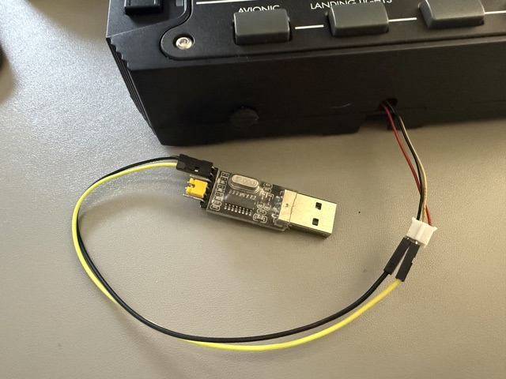

# Njoy32/VKB slave device protocol parser
A simple sniffer and parser for messages sent between controller and slave devices. It is still missing key pieces but is capable of capturing and decoding some messages.

# Hardware required
Of course it requires U(S)ART to USB bridge operating at 3.3V TTL levels and capable of achieving 500kbps speeds. 

