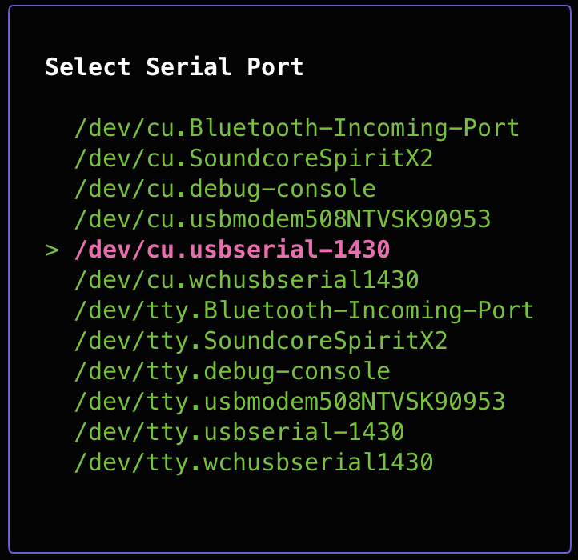
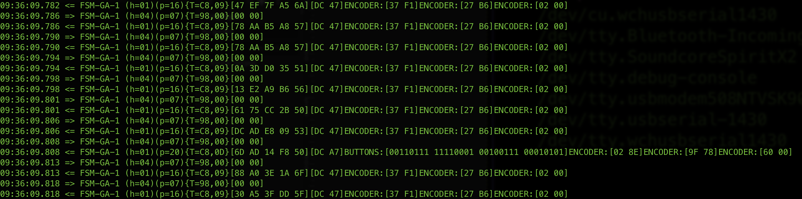

# Njoy32/VKB slave device protocol parser
A simple sniffer and parser for messages sent between controller and slave devices. It is still missing key pieces but is capable of capturing and decoding some messages.

# Hardware required
Of course it requires U(S)ART to USB bridge operating at 3.3V TTL levels and capable of achieving 500kbps speeds. 

# Building project
I'ts a simple Go program. All you need to do (and it works on any OS) is to download [go toolkit](https://go.dev/doc/install) and run "go build" command inside src directory.
Upon running you need to select proper port:

and it will start displaying partially decoded messages it sees on the connection:

